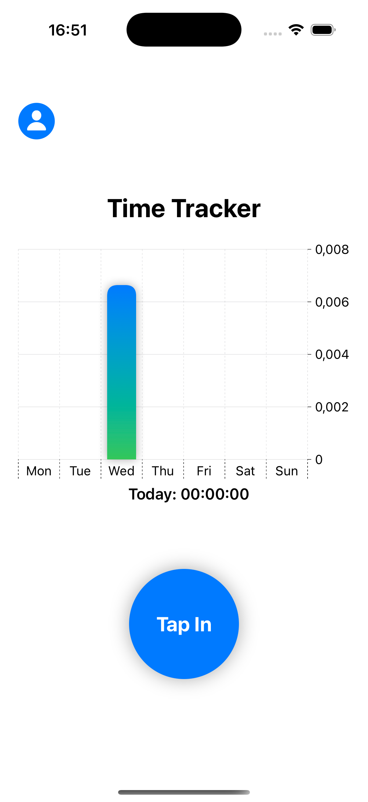
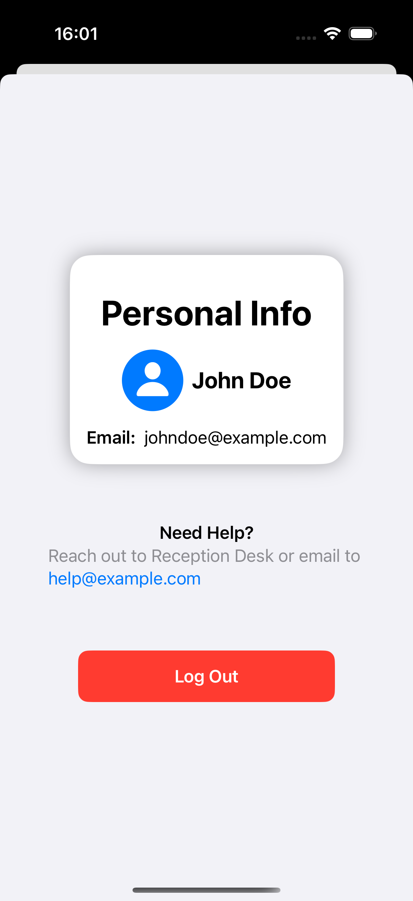

# Attendance Tracker

A simple yet powerful iOS app designed to track attendance for workers or students, ensuring precise time management and insightful analytics. Built with **SwiftUI**, the app features a smooth user experience, secure authentication, and a beautifully designed interface.

---

## 🚀 Features

- **Tap In & Tap Out**  
   - Users can log their attendance with Face ID authentication.  
   - Accurate time tracking with hours, minutes, and seconds displayed.

- **Daily Time Tracking**  
   - View how much time is spent on each day.  

- **Weekly Analytics**  
   - Visualize attendance data with an interactive bar chart for the past 7 days.

- **User Authentication**  
   - Local Sign In / Log In system.  
   - Personalized user profiles with name, surname, and email.  

- **Profile Badge View**  
   - Beautifully designed badge card showing user details.  

- **Support Information**  
   - Quick access to help and support options.

---

## 📸 Screenshots

---

## 🛠️ Technologies Used

- **Swift** & **SwiftUI**  
- **Face ID** for secure user verification  
- **Charts** for visualizing weekly analytics  
- **Local Storage** for managing user data and time logs

---

## 🎯 Future Enhancements
- Cloud-based storage for global accessibility
- Notifications for missed attendance logs
- Advanced analytics and reporting features
- Support for multiple roles (e.g., manager, employee, student)
